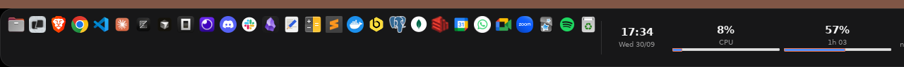

# Doca

A native dock for Linux with per-environment profiles and live widgets.
No Electron, no webview.

Doca is a Linux port of [PrimoDock](https://dock.oprimo.dev) (macOS).



## Requirements

| | |
|---|---|
| Session | X11 |
| Desktop | GNOME Shell 42+ |
| Toolkit | GTK3 |

## Build

```bash
sudo apt-get install -y pkg-config libgtk-3-dev
cargo build --release
```

## Run

### In a sandbox

```bash
./scripts/sandbox.sh
```

Opens a window you can click around in. Inside it is a nested X server with
its own session bus and its own config, seeded from your Plank launchers. The
dock in there reserves space on the nested screen, not yours; your own dock
keeps running untouched. Close the window to stop.

`--headless` runs the same thing on a virtual screen with no window at all,
for screenshots and CI.

This is the way to evaluate the dock at no risk.

### On your own session

```bash
./scripts/try-it.sh
```

Stops Plank, runs Doca in its place, and restarts Plank when you press
Ctrl-C. Two docks cannot share a screen edge — both reserve space through the
same strut protocol and each reacts to the other's reservation — so they take
turns rather than fight. On first run it seeds a config from your Plank
launchers so the dock is not empty.

If the script is killed outright rather than interrupted, Plank will not come
back on its own: `setsid plank >/dev/null 2>&1 &`.

If the dock ever covers the terminal you started it from, switch to a text
console with `Ctrl+Alt+F3`, log in, and run:

```bash
pkill -x doca-shell; pkill -x docad; setsid plank &
```

`Ctrl+Alt+F2` returns to the desktop.

## Configuration

`$XDG_CONFIG_HOME/doca/config.toml`:

```toml
[appearance]
theme = "native"
icon_size = 48
magnification = 1.6
auto_hide = false
show_trash = true

[[environments]]
name = "Work"
workspaces = [0, 1]
pinned = ["code", "dev.warp.Warp"]
widgets = ["clock", "pomodoro", "cpu", "battery"]
folders = ["~/Downloads"]

[[environments]]
name = "Personal"
workspaces = [2, 3]
pinned = ["discord", "spotify"]
widgets = ["clock", "music"]
```

The ids in `pinned` are `.desktop` file names without the extension. An
environment with no `workspaces` is a catch-all, used for any workspace no
other environment claims.

### Appearance

| key | |
|---|---|
| `theme` | `native` (translucent dark glass, blue accents — the default), `midnight` (solid near-black, navy tint), or `paper` (light cream, terracotta accents). An unknown name falls back to `native` with a warning. |
| `icon_size` | clamped to 24–96, and shrinks further on its own when there are more apps than fit, or than fit with the lens open. |
| `magnification` | how much the icon under the pointer grows, clamped to 1.0–2.5. `1.0` turns the lens off. The lens needs room to open, which comes out of the icon size on a crowded dock. |
| `auto_hide` | slides the bar off the bottom edge, leaving a two-pixel sliver to point at, and reserves only that sliver through the strut so maximised windows get the screen back. Pointing at the sliver slides it up; moving away slides it down. |
| `show_trash` | a trash item at the end of the bar. |

### Folders

A path in `folders` becomes a dock item that opens as a grid of its contents,
directories first, then names case-insensitively, capped at 60 entries. Hidden
entries are left out. Each entry opens with `xdg-open`; file icons come from
the content type, not the extension.

### Widgets

| id | shows | poll | click |
|---|---|---|---|
| `clock` | time and date | 1s | — |
| `battery` | charge and time to full or empty | 30s | — |
| `cpu` | busy share since the last sample | 2s | — |
| `network` | up and down rates | 2s | — |
| `music` | MPRIS title and artist | 2s | play/pause, right click resets |
| `pomodoro` | focus and break blocks | 1s | start/pause, right click resets |
| `stopwatch` | counting up, with laps | 1s | start/pause, right click resets |
| `timer` | counting down to a ring | 1s | start/pause, right click resets |
| `time-progress` | how much of a span has gone | 30s | next span, right click back to today |
| `countdown` | days to a date | 60s | — |
| `water` | glasses against a goal | 60s | one more, right click resets |
| `note` | a line you leave yourself | — | — |

Widgets that need settings take them from a `[widgets.*]` block:

```toml
[widgets.countdown]
date = "2026-12-25"
label = "until Christmas"

[widgets.note]
text = "Call the dentist\nThursday at four"

[widgets.timer]
minutes = 15

[widgets.water]
goal = 8
```

A poll is not an update: the scheduler compares the rendered state to the last
one and stays quiet when nothing changed, so a clock showing `17:21` is read
every second and announced once a minute.

## Switching environments

An environment is a dock: its own apps, its own widgets. Two of them can share
one workspace and be swapped by a key, or each can own a workspace and follow
it — `workspaces` is what decides which. Leave it off every environment and
the workspace stops deciding altogether; the first in the file is what you
start on.

A key puts an environment on screen and moves nothing. The choice stands until
you step onto a workspace some environment asked for by name: that is a choice
of its own and replaces the one the key made. A workspace only a catch-all
covers asks for nothing, so a dock chosen by hand survives moving across it.

The dock does not grab keys itself — on Linux the desktop owns the keyboard —
so bind one:

```bash
./scripts/bind-key.sh                    # <Super>e cycles environment
./scripts/bind-key.sh '<Super>x'         # the same action, your key
./scripts/bind-key.sh '<Super>1' Work    # one key straight to one environment
./scripts/bind-key.sh --list
./scripts/bind-key.sh --remove '<Super>1' Work
```

The script writes a GNOME custom keybinding whose command is a `gdbus call` to
`CycleEnvironment` or `SetEnvironment`. It exists because that list of
keybindings is shared by every application on the desktop: it has to be read
and written back, and a copy-pasted `gsettings set` that assigns the whole
array drops every shortcut you had. Each action owns a named slot, so running
it twice for one action moves that binding instead of adding another.

Keys bound before this project was renamed from PrimoDock to Doca sit in slots
named `primodock-*`, still calling a bus name that no longer answers: dead keys,
and `--list` does not see them to say so. Rebind each one with the commands
above, then delete the old entries — they show up under Settings → Keyboard →
Custom Shortcuts, named `PrimoDock: …`.

Cycling walks the environments in config order and wraps round, catch-alls
included: switching by hand needs no workspace to switch to. It refuses when
there is only one environment, which is the only case with nowhere to go.

## Changing the configuration while it runs

Everything in `config.toml` that the dock can change, it can change on the bus,
and the bar applies it without being restarted. The daemon is the only writer:
it validates what arrives, writes the file beside itself and renames it into
place — so a session that dies mid-write leaves the old config intact rather
than half a TOML — and then announces `ConfigChanged`, which the bar answers by
re-reading and reapplying the theme, the icon size, the lens, the auto-hide and
the trash on the window already on screen.

| method | |
|---|---|
| `SetAppearance(a{sv})` | changes only the keys named: `theme`, `icon_size`, `magnification`, `auto_hide`, `show_trash`. A key nobody knows is refused rather than ignored; a value out of range is brought back in (an `icon_size` of 4000 becomes 96). |
| `SetWidgetSetting(s, s, v)` | one widget's one setting: `countdown`/`date`, `countdown`/`label`, `note`/`text`, `timer`/`minutes`, `water`/`goal`. Written and announced — a widget already running keeps the setting it started with until the daemon restarts. |
| `AddEnvironment(s)` → `s` | a new dock, with nothing pinned and no workspace claimed, so it starts as a catch-all. Returns the name as stored. |
| `RemoveEnvironment(s)` | removes a dock. The last one cannot go: something always has to be on screen. |
| `RenameEnvironment(s, s)` → `s` | renames a dock, and follows the rename if that dock is the one a key put on screen. |
| `SetEnvironmentWorkspaces(s, ai)` | which workspaces a dock claims, tidied: sorted, deduplicated, negatives dropped. An empty list makes it the catch-all. |
| `SetEnvironmentWidgets(s, as)` | the widgets a dock shows, in the order it shows them. |
| `ReorderPinned(s, as)` | reorders one dock's pins and nothing more. An id that is not pinned there is refused, and an id left out keeps its place at the end — so a window working from a stale list cannot quietly unpin what it had not heard about. `PinItem`/`UnpinItem` remain the only way the set changes. |

Anything refused comes back as `InvalidArgs` with the reason in it, and nothing
is written. Numbers may be sent as any integer width, or as text, so a
keybinding or a `gdbus call` typed by hand works as well as a GUI does:

```bash
gdbus call --session --dest io.github.gusmartins499.Doca \
    --object-path /io/github/gusmartins499/Doca \
    --method io.github.gusmartins499.Doca1.SetAppearance \
    '{"theme": <"midnight">, "icon_size": <int32 64>}'
```

## Development

```
crates/doca-ipc     shared D-Bus contract
crates/docad        the daemon: windows, workspaces, state
crates/doca-shell   the bar: draws, anchors, never talks X11 policy
```

The D-Bus boundary between the two is load-bearing: when the X11 session goes
away, the shell is replaced and the daemon survives intact.

The row of icons is one widget that draws them all, not a widget each. A
widget per icon cannot animate: changing an icon's size changes what it asks
of its parent, so every frame of the lens renegotiates the layout of the whole
bar — 33 frames a second with twenty-nine icons, against 60 for a drawing.
Where an icon goes is a function of its own resting place and the pointer, and
of nothing else, so growing one cannot shift the rest by accumulation. Both
the shape of that and its constants come from
[Plank](https://github.com/ricotz/plank)'s `PositionManager`.

`scripts/dev-session.sh` is a barer version of the sandbox, for a debug build
with an empty config:

```bash
sudo apt-get install -y xserver-xephyr xvfb openbox dbus   # once
cargo build
./scripts/dev-session.sh
```

Some tests need a real X display and are marked `#[ignore]`. Run them from
inside a nested session:

```bash
DISPLAY=:9 cargo test -- --ignored
```

GTK belongs to the thread that starts it and the harness gives each test a
thread of its own, so those checks live beside the code they check and are
called from a single `on_a_display` test rather than being `#[test]`s.

Hover has no one to trigger it on a headless screen, so the pointer is moved
by hand — and, for clicks, pressed for real through XTEST:

```bash
DISPLAY=:9 cargo run -p docad --example warp-pointer -- 700 1035
DISPLAY=:9 cargo run -p docad --example warp-pointer -- 700 1035 click:3
```

## Not implemented

Thumbnail previews on window-list hover: on X11 they need composite redirect
and per-window pixmap capture, which is a great deal of machinery for a hover
effect. Right clicking an app with more than one window still lists the
windows by title, and clicking a title raises that window.
